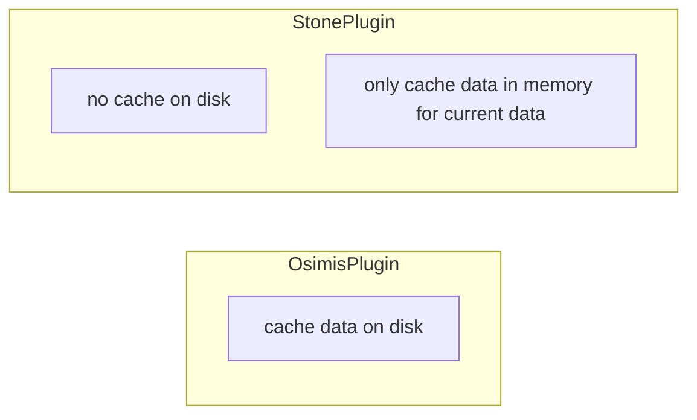

### Dicom 存储系统应用场景

- 医院/诊所 在医院和诊所环境中，Orthanc可以作为PACS系统的一部分，用于存储和检索医学图像数据。它可以集成到医院的信息技术基础设施中，与其他医疗设备（如CT扫描、MRI等）、医疗信息系统（如电子病历系统）等进行交互，为医生和临床工作人员提供快速的图像访问和诊断支持。

- 远程医疗服务 在远程医疗服务中，Orthanc可以作为远程诊断和咨询的平台，支持医生和患者之间的远程图像传输和共享。通过Orthanc，医生可以远程访问患者的医学图像数据，进行远程诊断和治疗建议，从而为患者提供更便捷和高效的医疗服务。

### Orthanc 承载能力
-  Orthanc 正在医院中用于生产，拥有超过 15TB 的数据、125,000 项研究和大约 5000 万个实例。其他用户甚至报告了超过 28TB 的数据

### Orthanc 通信协议支持
- DICOM协议：DICOM（Digital Imaging and Communications in Medicine）是医学图像领域的标准通信协议。Orthanc作为DICOM服务器，可以与DICOM设备（如医疗成像设备、PACS系统等）进行通信，接收、存储和检索DICOM图像数据
- RESTful API：Orthanc提供了基于HTTP的RESTful API，允许用户通过HTTP请求与Orthanc服务器进行通信。这使得用户可以通过编程方式执行各种操作，如上传图像、检索患者信息、查询图像等
- Websockets：Orthanc支持Websockets协议，允许实时通信和事件推送。通过Websockets，用户可以订阅特定事件（如新图像上传、患者数据更新等），并实时接收相关通知
- WADO协议：WADO（Web Access to DICOM Objects）是一种用于通过Web浏览器访问DICOM图像的协议。Orthanc可以通过WADO协议提供DICOM图像的Web访问功能，使用户可以直接通过浏览器查看DICOM图像数据。
- 其他：除了上述常见的通信协议外，Orthanc还支持其他一些协议和标准，如HTTP、HTTPS、JSON-RPC等，以便与其他系统和工具进行集成和交互。
通过支持多种通信协议，Orthanc可以与各种不同的系统和平台进行集成，从而实现医学图像数据的共享、存储和管理。

### 技术栈
- orthanc 
- c++ 
- mysql/postgreSql  
- nginx  
- 监控(Kafka Zabix Grafana...)

### 部署方式
- 云部署(aws/阿里云...)
- 本地部署(本地工作站...)

### orthanc 支持分布式部署

### 数据上传&检索

### Orthanc 鉴权
- 在Orthanc配置文件中启用基本身份验证：打开Orthanc的配置文件（通常是名为orthanc.json的文件），找到Authentication部分，并将其配置为使用基本身份验证
- 使用带有用户名和密码的HTTP请求：当向Orthanc发送HTTP请求时，您需要在请求头中包含用户名和密码信息。这样，Orthanc才能验证请求的发送者身份
- 基本身份验证不是最安全的身份验证方式，因为它会在每个请求中以明文方式传输用户名和密码。因此，在实际生产环境中，您可能需要使用更安全的身份验证方法，如TLS/SSL证书认证

### Data Cache  
- 关于数据缓存谁用谁缓存，orthanc 只是数据存储系统，不承担业务功能
- 通过插件形式创建webserver，数据缓存到webserver上，由插件自己来维护缓存 [创建插件](https://orthanc.uclouvain.be/book/developers/creating-plugins.html)
- 通过orthanc管理缓存
  - 内置缓存系统：Orthanc具有内置的缓存系统，可以配置来缓存常用的医学影像数据，以加快数据的访问速度。这些缓存可以在内存中或者硬盘上进行。

  - 插件支持：Orthanc具有丰富的插件系统，可以通过插件来扩展其功能。你可以编写自定义的插件来实现特定的缓存策略和管理功能。

  - 缓存策略配置：Orthanc允许用户根据需求配置缓存策略，包括缓存大小、缓存淘汰策略等。这样可以根据具体情况来优化缓存的使用。

  - 数据预加载：Orthanc可以预先加载一些数据到缓存中，以确保在需要时能够快速访问。这对于一些常用的影像数据特别有效。

  - 分布式缓存：如果你有多个Orthanc实例，你可以设置一个分布式的缓存系统，将缓存数据在不同的实例之间共享，以提高整个系统的性能和可扩展性。

### Plugin Cache Study

### 浏览器访问本地文件系统

- File API: File API 允许 JavaScript 代码通过用户交互来读取本地文件。用户选择文件，然后通过 JavaScript 读取所选文件的内容。这种方式不需要使用 WebAssembly。

- IndexedDB: IndexedDB 是浏览器中的一个客户端数据库，允许您存储大量结构化数据。您可以将文件内容存储在 IndexedDB 中，然后在需要时从中检索。这种方式同样不需要使用 WebAssembly。

- 与服务器交互: 如果您需要访问本地文件系统并进行文件操作，您可以通过与服务器交互来实现。用户可以通过浏览器上传文件到服务器，服务器执行文件操作，然后将结果返回给浏览器。这种方式可能需要使用 WebAssembly 来执行一些复杂的文件操作，但文件访问仍然是在服务器端完成的

### Rest Api 
Cheat sheet of the REST API [Rest Api 备忘清单](https://orthanc.uclouvain.be/book/users/rest-cheatsheet.html)
Cheat sheet of the REST API [Rest Api](https://orthanc.uclouvain.be/api/index.html)

### Orthanc Book
Welcome to the Orthanc Book [Orthanc Book Link](https://orthanc.uclouvain.be/book/index.html)

### viewer 下载速度对比
环境：orthanc + s3plugin
访问方式：远程（非部署机器）

osimis-viewr:
有缓存
下载数据大小：56.9M
下载时间：5.63s

无缓存
下载数据大小：56.9M
下载时间：11.86s

stone-viewer 
无缓存
下载数据大小：197M
下载时间：11.86s

ohif-viewer
无缓存
下载数据大小：148M (dicom 132M js资源16M)
下载时间：13.05s