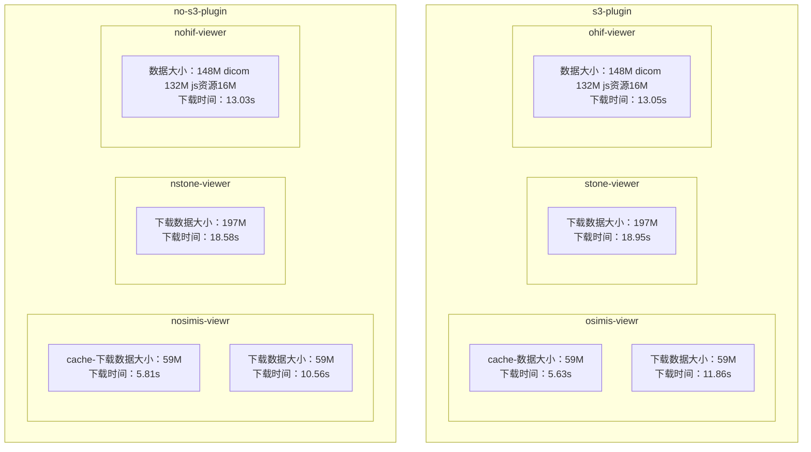
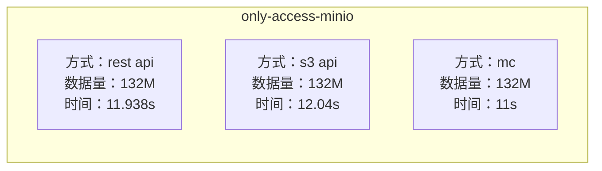
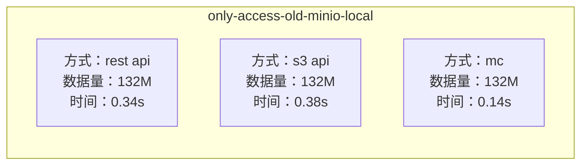
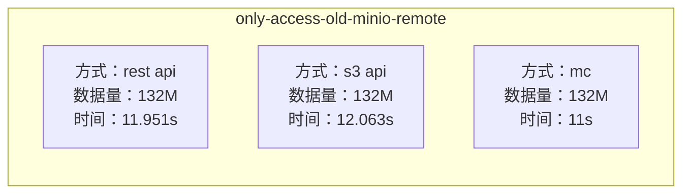
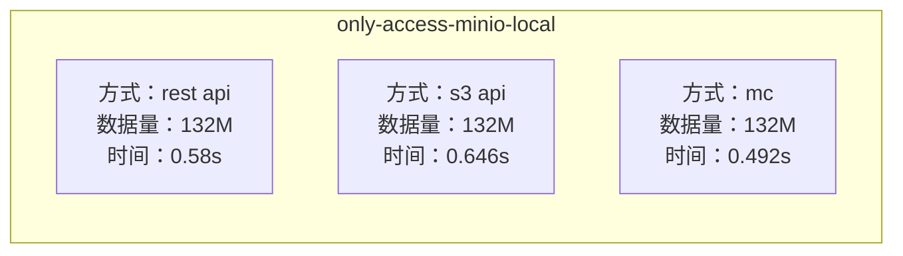
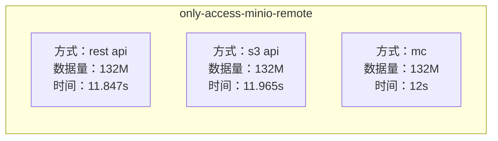
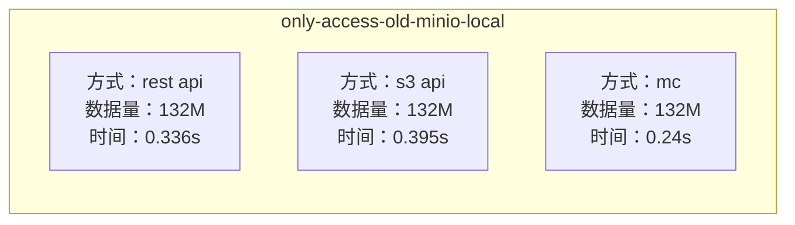
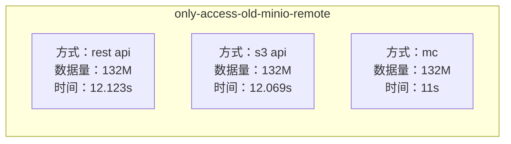
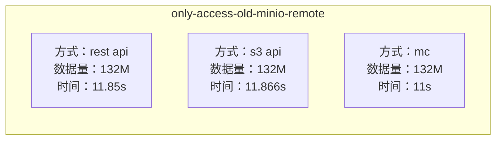

# 数据 132M 未压缩

### 新版minio
- 是否启用s3 Plugin viewer dicom数据下载速度对比
- 环境：orthanc + s3plugin
- 访问方式：远程（非部署机器）

### Only Access Minio
- RestApi单独从minio拿数据时间调研
    数据量：132M
    时间：11.938s

- 用js调用s3 api 去下载dicom速度
    数据量：132M
    时间：12.04s

- mc下载（远端非本地加密后）
    数据量：132M
    下载时间：11s

### 旧版minio（映射到本地目录）
- local：
- minio（2022年3月份之前的版本）映射到本地磁盘的数据，通过RestApi http请求下载 
    数据量：132M
    下载时间：0.34s

- 使用minio 自带命令 mc去下载求下载速度
    数据量：132M
    下载时间：0.14s

- 用js调用s3 api 去下载dicom 求时间
    数据量：132M
    下载时间：0.38s

- remote：
- minio（2022年3月份之前的版本）映射到本地磁盘的数据，通过RestApi http请求下载 
    数据量：132M
    下载时间：11.951s

- 使用minio 自带命令 mc去下载求下载速度
    数据量：132M
    下载时间：11s

- 用js调用s3 api 去下载dicom 求时间
    数据量：132M
    下载时间：12.063s

### 数据压缩后（gdcm压缩dicom --jpj2000）压缩后数据大小未改变
- 新版minio
- local
- minio（2022年3月份之前的版本）映射到本地磁盘的数据，通过RestApi http请求下载 
    数据量：132M
    下载时间：0.58s

- 使用minio 自带命令 mc去下载求下载速度
    数据量：132M
    下载时间：0.492s

- 用js调用s3 api 去下载dicom 求时间
    数据量：132M
    下载时间：0.646s

- remote
- minio（2022年3月份之前的版本）映射到本地磁盘的数据，通过RestApi http请求下载 
    数据量：132M
    下载时间：11.847s

- 使用minio 自带命令 mc去下载求下载速度
    数据量：132M
    下载时间：12s

- 用js调用s3 api 去下载dicom 求时间
    数据量：132M
    下载时间：11.965s

- 旧版minio
- local
- minio（2022年3月份之前的版本）映射到本地磁盘的数据，通过RestApi http请求下载 
    数据量：132M
    下载时间：0.336s

- 使用minio 自带命令 mc去下载求下载速度
    数据量：132M
    下载时间：0.24s

- 用js调用s3 api 去下载dicom 求时间
    数据量：132M
    下载时间：0.395s

- remote
- minio（2022年3月份之前的版本）映射到本地磁盘的数据，通过RestApi http请求下载 
    数据量：132M
    下载时间：12.123s

- 使用minio 自带命令 mc去下载求下载速度
    数据量：132M
    下载时间：11s

- 用js调用s3 api 去下载dicom 求时间
    数据量：132M
    下载时间：12.069s

### 打包dicom（132M）zip压缩包 再走一遍上面的流程比较下载速度
- 是否启用s3 Plugin viewer dicom数据下载速度对比
- 环境：orthanc + s3plugin
- 访问方式：远程（非部署机器）

- RestApi单独从minio拿数据时间调研
    数据量：132M
    时间：11.85s

- 用js调用s3 api 去下载dicom速度
    数据量：132M
    时间：11.866s

- mc下载（远端非本地加密后）
    数据量：132M
    下载时间：11s(zip 压缩后到minio上是解压后存储的数据量为变化)

